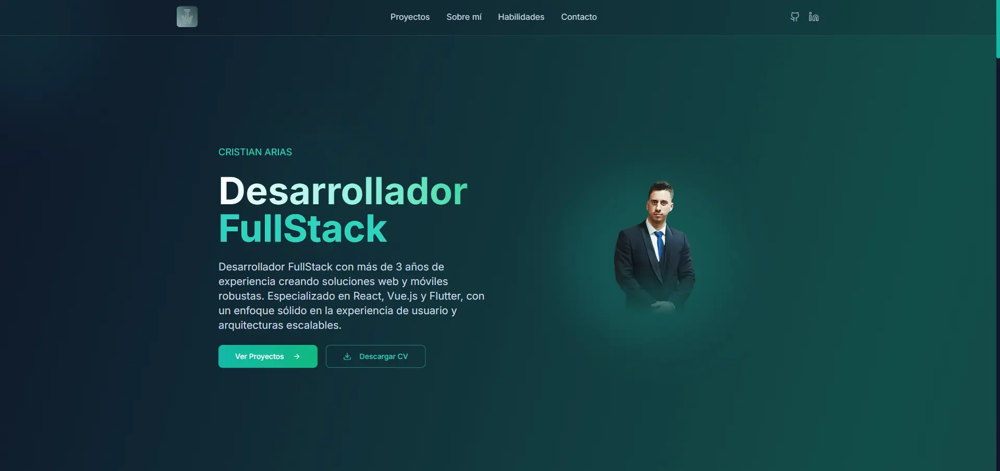

# 🌟 Portfolio Personal - Cristian Arias

[](https://vercel.com/titocristiandevgmailcoms-projects/titoworld.dev)
[](https://nextjs.org/)
[](https://www.typescriptlang.org/)
[](https://tailwindcss.com/)

> Portfolio personal moderno y responsivo de Cristian Arias, Desarrollador FullStack especializado en React, Vue.js y Flutter.

## 🚀 Demo en Vivo

**[https://titoworld.dev](https://titoworld.dev)**

## 📸 Vista Previa



## ✨ Características

- 🎨 **Diseño Moderno**: Interfaz elegante con gradientes y efectos visuales
- 📱 **Totalmente Responsivo**: Optimizado para móviles, tablets y desktop
- ⚡ **Alto Rendimiento**: Construido con Next.js 15 y optimizaciones avanzadas
- 🌙 **Efectos Interactivos**: Animaciones suaves y efectos de mouse
- 📧 **Formulario de Contacto**: Integración con Resend para envío de emails
- 🎯 **SEO Optimizado**: Meta tags y Open Graph configurados
- 🔧 **TypeScript**: Código tipado para mayor robustez
- 🎨 **Tailwind CSS**: Estilos utilitarios para desarrollo rápido
- 📦 **Componentes Reutilizables**: Arquitectura modular con shadcn/ui

## 🛠️ Stack Tecnológico

### Frontend
- **Framework**: Next.js 15 (App Router)
- **Lenguaje**: TypeScript
- **Estilos**: Tailwind CSS
- **Componentes**: shadcn/ui + Radix UI
- **Iconos**: Lucide React
- **Animaciones**: CSS Animations + Framer Motion concepts

### Backend & Servicios
- **Email**: Resend API
- **Deployment**: Vercel
- **Formularios**: React Hook Form + Server Actions

### Herramientas de Desarrollo
- **Linting**: ESLint
- **Formateo**: Prettier (implícito)
- **Control de Versiones**: Git + GitHub

## 📁 Estructura del Proyecto

```
portfolio-redesign/
├── app/                          # App Router de Next.js
│   ├── actions/                  # Server Actions
│   │   └── contact.ts           # Lógica de envío de emails
│   ├── link-tree/               # Página de enlaces
│   │   ├── layout.tsx
│   │   └── page.tsx
│   ├── globals.css              # Estilos globales
│   ├── layout.tsx               # Layout principal
│   ├── not-found.tsx            # Página 404 personalizada
│   ├── global-error.tsx         # Manejo de errores globales
│   └── page.tsx                 # Página principal
├── components/                   # Componentes reutilizables
│   ├── ui/                      # Componentes de shadcn/ui
│   ├── project-modal.tsx        # Modal de proyectos
│   └── theme-provider.tsx       # Proveedor de temas
├── lib/                         # Utilidades y datos
│   ├── skills.js               # Datos de habilidades
│   ├── projectsData.js         # Información de proyectos
│   ├── coursesAndCertifications.js # Cursos y certificaciones
│   ├── linkTree.js             # Enlaces para link tree
│   └── utils.ts                # Utilidades generales
├── public/                      # Archivos estáticos
│   ├── img/                    # Imágenes
│   └── documents/              # Documentos (CV)
└── styles/                     # Estilos adicionales
```

## 🚀 Instalación y Desarrollo

### Prerrequisitos
- Node.js 18+ 
- npm, yarn o pnpm

### Instalación

1. **Clona el repositorio**
   ```bash
   git clone https://github.com/titoworlddev/new-portfolio.git
   cd new-portfolio
   ```

2. **Instala las dependencias**
   ```bash
   npm install
   # o
   yarn install
   # o
   pnpm install
   ```

3. **Configura las variables de entorno**
   ```bash
   cp .env.example .env.local
   ```
   
   Añade tu API key de Resend:
   ```env
   RESEND_API=tu_api_key_aqui
   ```

4. **Ejecuta el servidor de desarrollo**
   ```bash
   npm run dev
   # o
   yarn dev
   # o
   pnpm dev
   ```

5. **Abre tu navegador**
   
   Visita [http://localhost:3000](http://localhost:3000)

## 📧 Configuración del Formulario de Contacto

El formulario de contacto utiliza [Resend](https://resend.com/) para el envío de emails:

1. Crea una cuenta en [Resend](https://resend.com/)
2. Obtén tu API key
3. Añádela a tu archivo `.env.local`
4. Configura tu dominio verificado en Resend (opcional pero recomendado)

## 🎨 Personalización

### Colores y Temas
Los colores principales se pueden modificar en `tailwind.config.ts`:

```typescript
theme: {
  extend: {
    colors: {
      // Personaliza los colores aquí
      primary: "hsl(var(--primary))",
      secondary: "hsl(var(--secondary))",
      // ...
    }
  }
}
```

### Contenido
- **Proyectos**: Edita `lib/projectsData.js`
- **Habilidades**: Modifica `lib/skills.js`
- **Cursos**: Actualiza `lib/coursesAndCertifications.js`
- **Enlaces**: Cambia `lib/linkTree.js`

### Imágenes
- Reemplaza las imágenes en `public/img/`
- Actualiza el CV en `public/documents/`

## 📱 Características Responsivas

- **Mobile First**: Diseñado primero para móviles
- **Breakpoints**: sm (640px), md (768px), lg (1024px), xl (1280px)
- **Navegación Adaptativa**: Menú hamburguesa en móviles
- **Imágenes Optimizadas**: Lazy loading y formatos modernos

## ⚡ Optimizaciones de Rendimiento

- **Next.js 15**: Última versión con mejoras de rendimiento
- **Server Components**: Renderizado del lado del servidor por defecto
- **Image Optimization**: Componente Image de Next.js
- **Code Splitting**: Carga automática de código bajo demanda
- **CSS Optimizado**: Tailwind CSS con purging automático
- **Lazy Loading**: Carga diferida de componentes pesados

## 🔧 Scripts Disponibles

```bash
# Desarrollo
npm run dev

# Construcción para producción
npm run build

# Iniciar servidor de producción
npm run start

# Linting
npm run lint
```

## 🚀 Deployment

Your project is live at:

**[https://titoworld.dev](https://titoworld.dev)**

### Vercel (Recomendado)
1. Conecta tu repositorio a Vercel
2. Configura las variables de entorno
3. Deploy automático en cada push

### Otras Plataformas
El proyecto es compatible con cualquier plataforma que soporte Next.js:
- Netlify
- Railway
- AWS Amplify
- DigitalOcean App Platform

## 🤝 Contribuciones

Las contribuciones son bienvenidas. Para cambios importantes:

1. Fork el proyecto
2. Crea una rama para tu feature (`git checkout -b feature/AmazingFeature`)
3. Commit tus cambios (`git commit -m 'Add some AmazingFeature'`)
4. Push a la rama (`git push origin feature/AmazingFeature`)
5. Abre un Pull Request

## 📄 Licencia

Este proyecto está bajo la Licencia MIT. Ver el archivo `LICENSE` para más detalles.

## 👨‍💻 Autor

**Cristian Arias**
- Portfolio: [titoworld.dev](https://titoworld.dev)
- GitHub: [@titoworlddev](https://github.com/titoworlddev)
- LinkedIn: [cristian-arias-mejuto](https://linkedin.com/in/cristian-arias-mejuto)
- Email: cariasmejuto@gmail.com

## 🙏 Agradecimientos

- [shadcn/ui](https://ui.shadcn.com/) - Componentes de UI
- [Tailwind CSS](https://tailwindcss.com/) - Framework de CSS
- [Next.js](https://nextjs.org/) - Framework de React
- [Vercel](https://vercel.com/) - Plataforma de deployment

---

<div align="center">
  <p>Hecho con ❤️ por Cristian Arias</p>
  <p>
    <a href="https://titoworld.dev">Portfolio</a> •
    <a href="https://github.com/titoworlddev">GitHub</a> •
    <a href="https://linkedin.com/in/cristian-arias-mejuto">LinkedIn</a>
  </p>
</div>
